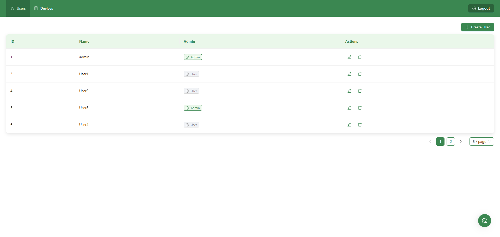
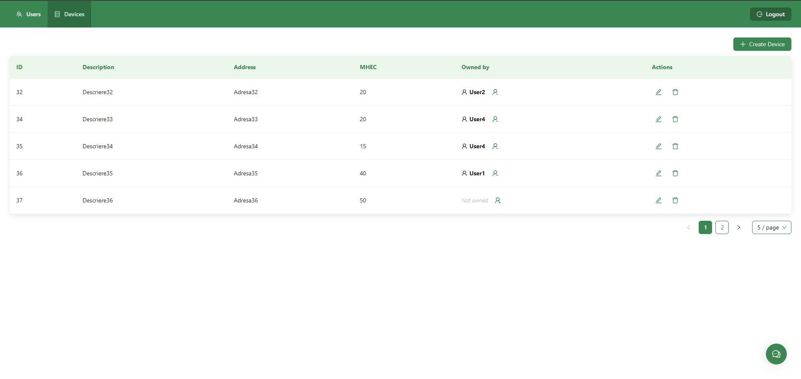
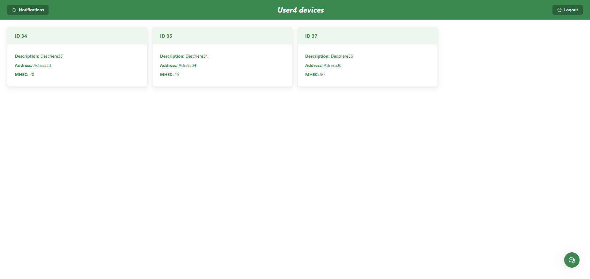
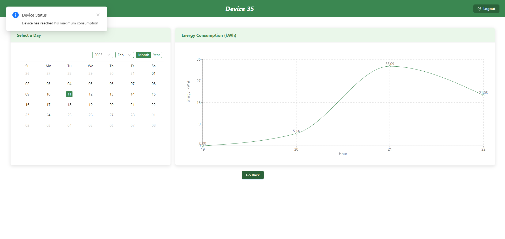
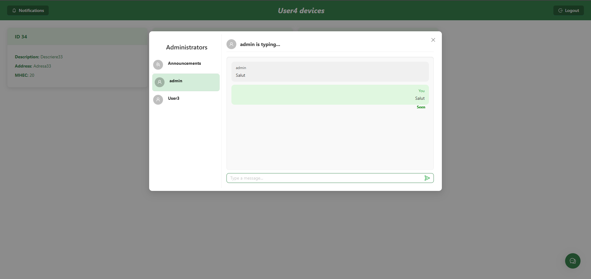

# Energy Management System (EMS)

## Overview

The Energy Management System (EMS) is designed to facilitate effective management of users and their smart energy metering devices. This system enables users to monitor and manage their energy consumption, promoting efficient energy use across various locations. Also has an chat system between users and administrators. The EMS includes a user-friendly frontend and a distributed backend with four primary microservices.

## Functionalities Overview

### Administrator Functionalities
- **User Management**: Full control to create, edit, and delete user accounts.
- **Device Management**: Perform CRUD operations on energy metering devices and manage their association with users.

### Client Functionalities
- **Device Viewing**: Clients can view and monitor real-time and historical data for their devices.

### Communication and Alerts
- **Chat System**: Facilitates real-time communication between users and administrators.
- **Automated Alerts**: Notifications for energy consumption thresholds and system health.

### Monitoring and Control
- **Monitoring Microservice**: Offers real-time and historical data analysis, integrated with WebSocket for instant notifications.
- **Device Simulator**: Simulates device data for testing and monitoring system performance.

### Security Features
- **Role-Based Access Control (RBAC)**: Manages user access based on roles using Spring Security, ensuring that users can only access appropriate system functions.
- **Data Security**: Implements Spring Security for authentication and authorization, protecting sensitive information with encryption and secure data storage practices.

### Deployment and Maintenance
- **Docker Integration**: Utilizes Docker for scalable and manageable deployment of services.

## Build and Execution Considerations

### Prerequisites

To run this application, ensure the following are installed on your system:

- **Docker**: to containerize and manage each service.
- **WSL (Windows Subsystem for Linux)** with **Ubuntu**: required if you're running this setup on Windows to ensure compatibility with Docker and other development tools.
- **RabbitMQ Configuration**: Ensure you have RabbitMQ credentials (e.g., from CloudAMQP) to connect the microservices. A `.env` file is required for `DeviceMicroservice` `MonitoringMicroservice` and `deviceSimulator` with the following keys:
   - **RABBITMQ_HOST=** 
   - **RABBITMQ_USERNAME=** 
   - **RABBITMQ_PASSWORD=** 
   - **RABBITMQ_VHOST=**

Fill these values with the RabbitMQ details from your RabbitMQ instance or CloudAMQP account.

### Initial Setup and Default Admin User

When the application is started for the first time, a default admin user is automatically inserted into the database:

- **Username**: `admin`
- **Password**: `123`

This admin user has full CRUD access for managing users and devices.

### Building and Running the Application

1. **Clone the repository** to your local machine.
2. **Navigate to the project root directory** in your terminal.
3. **Execute the following command** to build and start the application:

   ```bash
   docker-compose up --build -d
   ```

   - The `--build` flag forces Docker to rebuild the images, ensuring that any updates to the application code are reflected in the containers.
   - The `-d` flag starts containers in the background and detaches them from your terminal session.
4. **Device Simulator Configuration**:
   - In `deviceSimulator/src/main/resources`, configure the file `config.properties` with the IDs of the devices you want to simulate:
     ```
     device_Ids=1,2,3, .... (for example)
     ```
     This simulates data for the specified devices.
   - Start the simulator with the following command:
     ```bash
     docker-compose --profile manual up devicesimulator --build -d
     ```


### Accessing the Application

- Once the containers are up, the **frontend** (React TypeScript app) will be accessible at `http://energy-app.localhost/`.
- The **backend microservices** (Spring Boot apps) handle user management and device management. They can be accessed internally by the frontend and communicate over specified ports.

## Services Overview

The EMS application is composed of three main services:

- **Frontend (`energy-app`)**: Built with React and TypeScript, providing the user interface for energy management.
- **Backend Microservices**:
  - **User Management (`energyUser`)**: A Spring Boot service managing user accounts and roles.
  - **Device Management (`energyDevice`)**: A Spring Boot service handling energy metering devices and associated data.
  - **Monitoring Microservice (`energyMonitoring`)**: A Spring Boot service for monitoring real-time and historical device data, including WebSocket-based notifications.
  - **Chat Microservice (`energyChat`)**: A Spring Boot service which handle the communication between users and administrators.
- **Device Simulator**: A standalone component that simulates energy consumption data for devices and sends it to the Monitoring Microservice via RabbitMQ.

Each microservice runs in its own Docker container, facilitating scalability and modularity.

### Running the Application from an IDE

To run the application from an IDE instead of Docker, follow these steps:

#### Frontend (React TypeScript)

1. Open the `energy-app` folder in Visual Studio Code.
2. Install dependencies by running:

   ```bash
   npm install
   ```

3. Start the development server with:

   ```bash
   npm start
   ```

   The frontend should now be accessible at `http://localhost:3000`.

#### Backend (Spring Boot Microservices)

1. Open each backend project (`energyUser`, `energyDevice`, `energyMonitoring` and `energyChat`) in IntelliJ IDEA or another Java-compatible IDE.
2. Make sure you have Java and Maven installed and configured in your IDE.
3. Install dependencies by running the followind command or from your IDE find the Lifecycle for maven install:

   ```bash
   mvn install
   ```

4. Run each Spring Boot application by executing the `main` method in their respective main classes.

   - `energyUser`, `energyDevice`, `energyMonitoring` and `energyChat` services will start on their configured ports as defined in `application.properties`.

#### Device Simulator
1. Open the project the same as in the backends
2. In `deviceSimulator/src/main/resources`, configure the file `config.properties` with the IDs of the devices you want to simulate:
     ```
     device_Ids=1,2,3, .... (for example)
     ```
     This simulates data for the specified devices.
3. Install dependencies the same and then run the application from `DeviceSimulator` file.


### Database Setup with PostgreSQL Dump Files

1. Ensure PostgreSQL is installed and running on your system.
2. Create databases for `energyUser`, `energyDevice` and `energyMonitoring` microservices as required.
3. Load the database dump files `userdb.sql`, `devicedb.sql` and `monitoringdb.sql`.
4. Update `application.properties` in each backend project to match your PostgreSQL configuration, if necessary.

## Additional Notes

- **User Roles**: The system supports multiple roles, such as administrators (who have CRUD access to users and devices) and regular users (who can manage their own devices).
- **Docker Considerations**: Docker Compose is used to simplify deployment and ensure that all services are correctly networked. Ensure no conflicts on ports used by the services (e.g., 3000 for frontend, specific backend ports as configured).

### Screenshots





